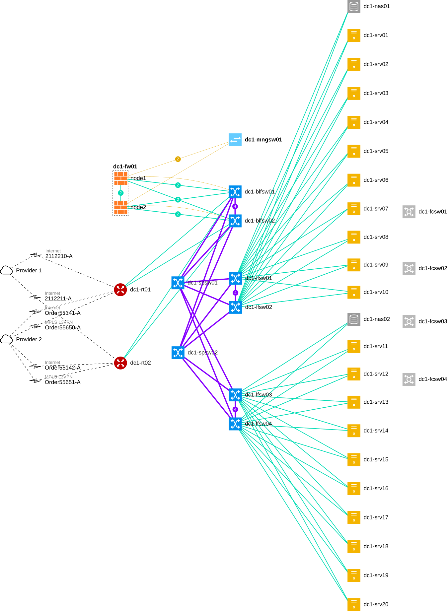

# Ntmap

Ntmap is a tool to visualize network topologies using [Netbox](https://github.com/netbox-community/netbox) as a data source.



This fork reads topology data from the **NetBox REST API** (token auth) instead of querying NetBox’s Postgres database directly. Map metadata is still stored in Ntmap’s own Postgres database.

## Run with Docker

Requirements:

- Docker and Docker Compose
- A reachable NetBox instance (3.x / 4.x) and an API token with read access to devices, interfaces, providers, and circuits

```bash
cp .env.example .env
# Edit .env: set NETBOX_URL, NETBOX_TOKEN, and matching NTMAP_DB_PASSWORD + POSTGRES_PASSWORD
docker compose up --build
```

Open [http://localhost:8080](http://localhost:8080).

Compose starts:

- `ntmap` — nginx (static UI) + gunicorn (API) on port 8080
- `ntmap-db` — Postgres for map groups/maps

NetBox itself is **not** included; only `NETBOX_URL` and `NETBOX_TOKEN` are required.

| Variable | Purpose |
|----------|---------|
| `NETBOX_URL` | Base URL of NetBox (e.g. `https://netbox.example.com`) |
| `NETBOX_TOKEN` | NetBox API token |
| `NTMAP_DB_PASSWORD` / `POSTGRES_PASSWORD` | Same local DB password (loaded via Compose `env_file`; not inlined in YAML) |
| `NTMAP_DB_*` | Other credentials for the compose Postgres service |
| `NTMAP_HTTP_PORT` | Host port (default `8080`) |

**Notes**

- Upstream Ntmap targeted NetBox 3.3 DB schema. The API client targets NetBox 3.x/4.x REST responses; nested field shapes can vary by version—verify against your NetBox.
- Topology builds may be slower than the original SQL joins because of HTTP round-trips.
- Do not commit `.env`, `backend/app/settings.ini`, or `www/js/settings.js` with real secrets.

## Installation (non-Docker)

Please see the [installation guide](docs/installation.md) for a classic (venv + systemd + nginx) install. When configuring `backend/app/settings.ini`, use the `[netbox]` `url` and `token` options (not a database connection string).

## Usage

You can find short instructions on how to use Ntmap in the [documentation](docs/index.md).

## Providing Feedback

Feature requests and bug reports are welcomed as GitHub issues.
